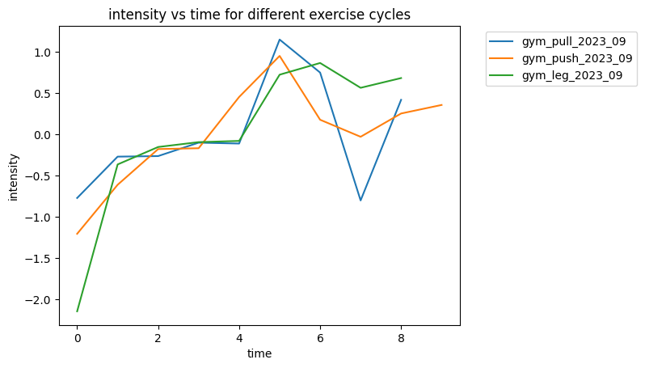

# exercise_analysis

I have been tracking my calisthenics and gym exercise progress for the past 3 years on google sheets. The system in this github repository is able to parse every set, rep, and weight I have lifted since then. My workouts usually slightly change every couple months, which I call a "cycle". In `analysis.ipynb`, we can easily analyze the many properties of these cycles.

For example, here is a plot of intensity vs time for 3 different exercise groups in the same cycle. I calculate intensity as the predicted one rep max, zscored, and averaged among exercises.

# formats

## gca
- gca format stands for gym, calisthenics, and accessory format.
- column 1 is not used by the parser and can be used as the athlete for any purpose
- column 2 contains exercise names (with a prepended special character)
  - "-" means the exercise does not belong to any cycle
  - "" no prepended special character means the exercise belongs to a gym cycle
  - "*" means the exercise belongs to a calisthenics cycle
  - "**" means the exercise belongs to an accessory cycle
- remaining columns contain encoded sets, reps, and weight for each day. columns that are further to the left represent days that happen after columns/days further to the right.
  - gym ("") and accessory ("**") cycles are encoded as follows for each day:
    - set groups are seperated by ","s
    - set groups may contain sets, reps, and weight which are seperated by "x"s
    - if there are 3 values -> (sets, reps, weight)
    - if there are 2 values -> (reps, weight) and sets = 1
    - if there are 1 values -> (reps) and sets = 1 and weight = 1
    - if there are 0 values -> no exercise was done
  - calisthenics ("*") cycles are encoded as follows for each day:
    - set groups are seperated by ","s
    - set groups may contain sets and reps which are seperated by "x"s
    - if there are 2 values -> (sets, reps) and sets = 1
    - if there are 1 values -> (reps) and sets = 1
    - if there are 0 values -> no exercise was done
    